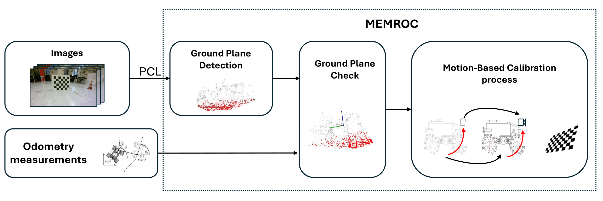
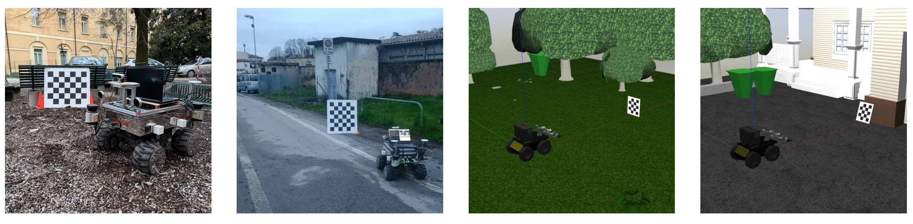
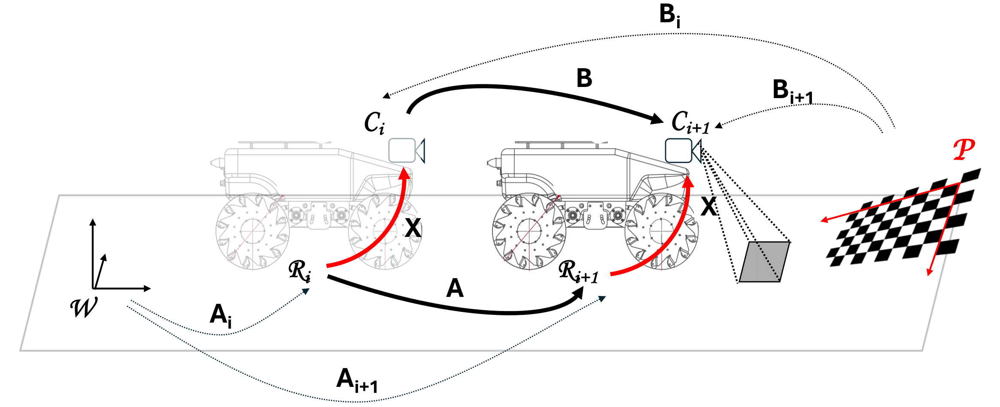

# MEMROC: Multi-Eye to Mobile RObot Calibration
#### Abstract
This work presents MEMROC (Multi-Eye to Mobile RObot Calibration), a novel motion-based calibration method that simplifies the process of accurately calibrating multiple cameras relative to a mobile robot’s reference frame. MEMROC utilizes a known calibration pattern to facilitate accurate calibration with a lower number of images during the optimization process. Additionally, it leverages robust ground plane detection for comprehensive 6-DoF extrinsic calibration, overcoming a critical limitation of many existing methods that struggle to estimate the complete camera pose. The proposed method addresses the need for frequent recalibration in dy- namic environments, where cameras may shift slightly or alter their positions due to daily usage, operational adjustments, or vibrations from mobile robot movements. MEMROC ex- hibits remarkable robustness to noisy odometry data, requiring minimal calibration input data. This combination makes it highly suitable for daily operations involving mobile robots. A comprehensive set of experiments on both synthetic and real data proves MEMROC’s efficiency, surpassing existing state- of-the-art methods in terms of accuracy, robustness, and ease of use. 

[Arxiv](https://arxiv.org/abs/2410.08805)



## Installation
Download the repository
```
git clone https://github.com/davidea97/MEMROC.git
```
and move forward with the compilation

```
mkdir build
cd build
cmake ..
make -j8
```

## Dataset download
This work introduces a comprehensive dataset comprising both synthetic and real images.

_Dataset soon avaialble_: You can download the dataset directly from the following [link](URL) or use your own data.


It is essential that the structure of your data is as follows:

* [README.md](./README.md)
* [src](./src)
* [data](./data)
   * [<name_of_your_data_folder>](./data/exp1)
        * [camera1](./data/exp1/camera1)
          * [clouds](./data/exp1/camera1/clouds)
          * [image](./data/exp1/camera1/image)
          * [pose](./data/exp1/camera1/image)
          * intrinsic_pars_file.yaml
        * [camera2](./data/exp1/camera1)
        * [cameraN](./data/exp1/camera1)
        * CalibrationInfo.yaml
* [include](./include)
* [build](build)
* [CMakeLists.txt](./CMakeLists.txt)

#### More in detail: 
The CalibrationInfo.yaml must have the following structure:
```
number_of_cameras: 3          # Number of cameras you want to calibrate
camera_folder_prefix: camera  # Camera folder name where pose and image subfolders are located
pattern_type: checkerboard    # Pattern type used

number_of_rows: 3             # Number of rows
number_of_columns: 4          # Number of columns
size: 0.10                    # Pattern size

resize_factor: 1              # Resize factor
``` 
* **Cameras folder**: The number of folders in this directory must match the number of cameras you wish to calibrate. This should correspond to the information set in the `CalibrationInfo.yaml` file.

* **Clouds folder**: This folder should contain `.txt` files (e.g., `0000.txt`, `0001.txt`, ...) with 3D point data. Each file represents a point cloud in the camera's reference frame, with each row corresponding to a single 3D point (x y z). These point clouds are collected at different robot poses, but the number of files does not need to match the number of robot poses—one file is sufficient. If only RGB images are available, you can extract the point cloud by using two images from the same camera taken at different poses. Apply feature extraction and matching methods to these images and triangulate the 3D points using the camera's relative poses, which can be computed by detecting the calibration pattern.

* **Image folder**: This directory contains the images captured by the sensors, named sequentially (e.g., `0000.png`, `0001.png`, ...).

* **Pose folder**: This folder should include `.csv` files (e.g., `0000.csv`, `0001.csv`, ...) that represent the 4x4 rototranslation matrices of the mobile robot with respect to its initial pose, as provided by odometry measurements. Each row in the CSV file represents the first row of a 4x4 transformation matrix.

* **intrinsic_pars_file.yaml**: This file contains the intrinsic parameters for each camera. It must follow the structure outlined below:


```
fx: 1108.509382382374
fy: 1108.509382382374
cx: 640.5
cy: 360.5
has_dist_coeff: 1
dist_k0: 0.0
dist_k1: 0.0
dist_px: 0.0
dist_py: 0.0
dist_k2: 0.0
dist_k3: 0
dist_k4: 0
dist_k5: 0
img_width: 1280
img_height: 720
``` 


## Calibration process usage


To run the code, make sure the following libraries are properly installed:

- [Ceres Solver](http://ceres-solver.org/)
- OpenCV (version > 4.2)
- Eigen (version > 3.3.7)
- PCL (Point Cloud Library)

Once the dependencies are installed, follow these steps to execute the program:

```bash
cd build
./MEMROC ../data/<name_of_your_data_folder>/
```

## Citation
If you find this code useful in your work, please acknowledge it by citing the following reference:
```
@misc{allegro2024memrocmultieyemobilerobot,
      title={MEMROC: Multi-Eye to Mobile RObot Calibration}, 
      author={Davide Allegro and Matteo Terreran and Stefano Ghidoni},
      year={2024},
      eprint={2410.08805},
      archivePrefix={arXiv},
      primaryClass={cs.RO},
      url={https://arxiv.org/abs/2410.08805}, 
}
```
## License
The MEMROC dataset is released under the CC BY-NC-SA 4.0 license. Authors reserve the right to change the license in the future. Authors of the MEMROC dataset are not responsible for any misuse of the dataset or any potential harm caused by the use of the dataset.

